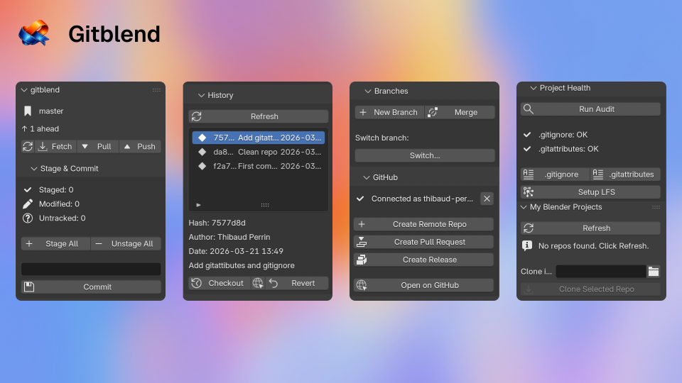

# gitblend

**Version your Blender projects like code, without leaving Blender.**



[](https://www.gnu.org/licenses/gpl-3.0)
[](https://www.blender.org/)
[](https://www.python.org/)

gitblend is a Blender extension that brings Git and GitHub versioning workflows directly into Blender. Save states, browse history, manage branches, push to GitHub, and protect your project — all without opening a terminal.

It is designed for artists, tech artists, and small teams who work with `.blend` files and binary assets. It assumes `.blend` files are binary (because they are) and builds a reliable workflow around snapshots, history, branches, sync, and sharing — rather than pretending merges are safe.

---

## Features

### Core versioning

- Initialise a git repo from the current project directory
- See the working tree status at a glance (staged, modified, untracked, conflicts)
- Auto-save the `.blend` before committing
- Commit with a custom or auto-suggested message
- Browse commit history with author, date, and short hash
- Checkout a previous commit, branch, or tag (with automatic `.blend` backup)
- Revert a single file or an entire commit
- Create, switch, and delete branches
- Merge branches with conflict detection

### GitHub integration

- Authenticate via Personal Access Token or browser device flow (no copy-paste required)
- Create a GitHub repository directly from Blender
- Push, pull, and fetch
- Create and view Pull Requests
- Create versioned releases and tags
- Open the repo, commit, or PR in the browser with one click

### Project health

- Audit the project for portability issues before committing
- Detect files exceeding GitHub's 100 MB limit
- Generate a Blender-appropriate `.gitignore`
- Set up git LFS with one click for all standard binary types
- Generate a `.gitattributes` file with LFS tracking rules

### Blender UX

- Dedicated **Git** tab in the 3D View N-panel
- Background fetch/push so Blender stays responsive
- Automatic `.blend` backup before every restore or checkout operation
- Explicit status labels: branch name, ahead/behind count, conflict state, detached HEAD
- All destructive actions require confirmation

---

## Requirements

| Requirement | Version                                      |
| ----------- | -------------------------------------------- |
| Blender     | 4.2 or later                                 |
| git         | Any recent version, installed on the system  |
| git-lfs     | Optional — required for LFS features only    |
| Internet    | Optional — required for GitHub features only |

gitblend has **zero runtime Python dependencies**. It uses only the standard library, so there is nothing to bundle or install beyond git itself.

---

## Installation

### Option A — Build and install from source (recommended)

```bash
git clone https://github.com/hallcyn/gitblend.git
cd gitblend
uv sync --dev

# Build the extension zip
uv run python tools/package_extension.py
# → dist/gitblend-0.1.0.zip
```

1. In Blender, open **Edit → Preferences → Add-ons**.
2. Click **Install from Disk…** and select `dist/gitblend-0.1.0.zip`.
3. Enable the **gitblend** addon (Development category).
4. The **Git** tab appears in the **3D View N-panel** (press `N` to open it).

### Option B — Development install (live reload, no zip rebuild)

```bash
git clone https://github.com/hallcyn/gitblend.git
cd gitblend
uv sync --dev

# Create a symlink from Blender's addons directory to the source
uv run python tools/dev_install.py

# To remove the symlink
uv run python tools/dev_install.py --uninstall

# If Blender is not in the default location
uv run python tools/dev_install.py --blender /path/to/Blender.app
```

Enable the addon in **Edit → Preferences → Add-ons → gitblend**. After editing source files, use **Reload** in the addon preferences — no zip rebuild needed.

### Blender version compatibility

| Blender version | Status    |
| --------------- | --------- |
| 4.2 LTS         | Supported |
| 4.3             | Supported |
| 4.4             | Supported |
| 5.0             | Supported |
| 5.1+            | Supported |

### Preferences

Open **Edit → Preferences → Add-ons → gitblend** to configure:

| Preference                  | Default        | Description                                            |
| --------------------------- | -------------- | ------------------------------------------------------ |
| **Git Binary**              | _(system git)_ | Override the path to the `git` executable              |
| **Enable LFS support**      | On             | Show LFS buttons and check for git-lfs                 |
| **Auto-save before commit** | On             | Save the `.blend` automatically before each commit     |
| **Backup before restore**   | On             | Create a `.blend` backup before any checkout or revert |

Credentials (GitHub tokens) are stored in the system keychain — never in project files.

---

## Quick Start

1. **Open and save** your `.blend` file.
2. Press `N` in the 3D View to open the sidebar and select the **Git** tab.
3. Click **Init Repository** — gitblend creates a git repo in your project directory.
4. Click **Stage All** then enter a commit message and click **Commit**.

That's it. Your project is versioned.

### Commit workflow

```
Git tab
 └── Stage & Commit
      ├── [Stage All]       ← stages everything
      ├── Commit message:   ← type your message
      └── [Commit]          ← creates the commit
```

### Browse history

Open the **History** sub-panel to see all commits. Select a commit to:

- **Checkout** — restore the project to that state (backs up current `.blend` first)
- **Revert** — create a new commit that undoes it
- **Open on GitHub** — jump to that commit in the browser

---

## GitHub Setup

### Option A — Personal Access Token (recommended for personal use)

1. Go to **GitHub → Settings → Developer settings → Personal access tokens → Fine-grained tokens**.
2. Create a token with **Contents** read/write and **Pull requests** read/write scopes.
3. In Blender, open the **GitHub** sub-panel → **Connect with Token** and paste the token.

### Option B — Browser device flow

1. In the **GitHub** sub-panel, click **Connect via Browser**.
2. A code appears in the panel. Your browser opens `github.com/login/device`.
3. Enter the code and authorize gitblend.
4. Click **I've authorized — continue** in Blender.

Once connected, you can create a remote repo, push, create PRs, and manage releases without leaving Blender.

---

## Git LFS

`.blend` files and other binary assets (textures, caches, renders) can be large. GitHub blocks files over 100 MB. Git LFS stores binary content outside the repo and replaces it with small pointer files.

### Set up LFS

1. [Install git-lfs](https://git-lfs.com/) on your machine.
2. Open the **Project Health** sub-panel → **Setup LFS**.
3. Commit the generated `.gitattributes` file.

gitblend tracks these patterns automatically:

```
*.blend  *.fbx  *.usd  *.usdc  *.usda  *.usdz  *.abc
*.exr    *.hdr  *.tif  *.tiff  *.psd   *.vdb
*.mp4    *.mov  *.avi  *.obj   *.ply   *.stl   *.bvh
```

### Check for large files

Open **Project Health → Check Large Files** to find files over 50 MB that aren't tracked by LFS.

---

## Backups

Before every checkout, revert, or restore operation, gitblend automatically copies the current `.blend` file to:

```
<project-root>/.gitblend-backups/<filename>.<timestamp>.blend
```

This directory is excluded from git by the generated `.gitignore`.

---

## Known Limitations

- **`.blend` files are binary.** Git cannot merge them intelligently. Conflicts mean choosing one version over the other.
- **No real-time collaboration.** gitblend does not add live co-editing to Blender.
- **No in-scene semantic diff.** History shows file-level changes, not scene-level changes (objects added, materials changed, etc.).
- **git must be installed.** gitblend calls the system `git` binary; it does not bundle git.
- **git-lfs is optional but strongly recommended** for projects with large binary assets.
- **GitHub features require internet.** All local git operations work completely offline.
- **GitHub's 100 MB file limit applies.** Set up LFS before pushing large files.

---

## Development

### Setup

```bash
git clone https://github.com/hallcyn/gitblend.git
cd gitblend
uv sync --dev
```

### Commands

```bash
# Lint
uv run ruff check gitblend/

# Format
uv run ruff format gitblend/

# Type check
uv run mypy gitblend/

# Unit tests (no Blender required)
uv run pytest tests/unit/ -v

# Integration tests (real git repos in temp dirs)
uv run pytest tests/integration/ -v

# All tests
uv run pytest
```

### Architecture

The codebase uses a strict layered architecture to keep business logic independent of Blender:

```
gitblend/
  domain/          # Pure models, enums, errors, Result type — no dependencies
  infrastructure/  # subprocess_runner, file_system, auth_store, parsers
  services/        # Business logic (git, github, lfs, diagnostics, snapshot)
  bpy_adapters/    # Blender API wrappers — only layer allowed to import bpy
  operators/       # Thin Blender operator wrappers
  ui/              # Panels, lists, menus, dialogs
```

**Rule:** `domain/`, `services/`, and `infrastructure/` must never import `bpy`. This makes ~80% of the codebase testable with plain `pytest`, without launching Blender.

---

## Contributing

Bug reports and pull requests are welcome. See [issues](https://github.com/hallcyn/gitblend/issues).

Please run `uv run ruff check gitblend/` and `uv run pytest` before submitting a PR.

---

## License

GPL-3.0-or-later — consistent with the Blender ecosystem.

See [LICENSE](LICENSE) for the full text.
